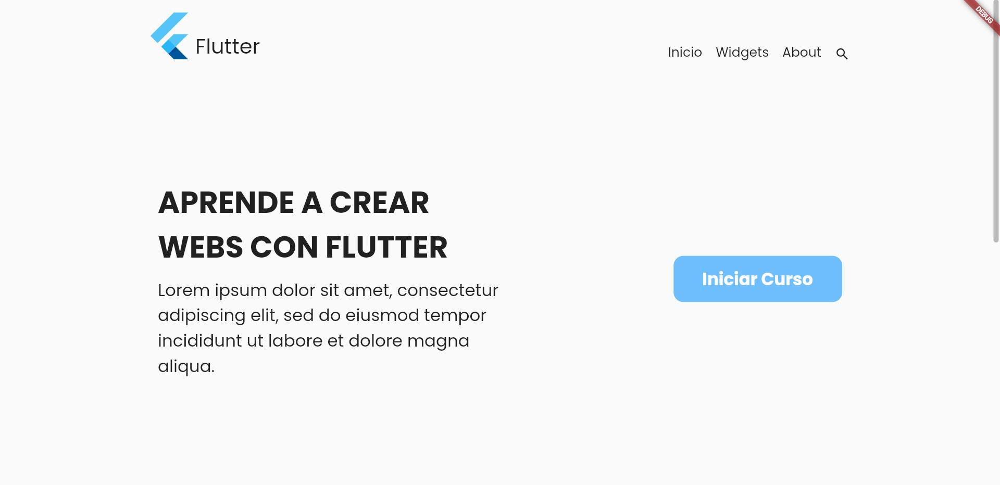

# Proyecto Flutter 01 - FernandezGomezD01

Este proyecto Flutter tiene como objetivo **crear una réplica** siguiendo las instrucciones proporcionadas. Los objetivos principales son los siguientes:

### Estructura del proyecto

* **Organización de las carpetas:** Los widgets se organizan en carpetas separadas para una mejor estructura y mantenibilidad del código.
* **Evitar árboles de widgets infinitos:** Se ha tenido cuidado de evitar crear un árbol de widgets infinito.

### Exploración de widgets

Se han incorporado widgets adicionales no cubiertos en clase y se ha investigado su uso en la documentación oficial de Flutter: [https://docs.flutter.dev/](https://docs.flutter.dev/)

* FlutterLogo: [https://api.flutter.dev/flutter/material/FlutterLogo-class.html](https://api.flutter.dev/flutter/material/FlutterLogo-class.html)
* Icono: [https://api.flutter.dev/flutter/widgets/Icon-class.html](https://api.flutter.dev/flutter/widgets/Icon-class.html)

### Pantallas

#### Pantalla 1: Navegación con componentes

* **Descripción:** La primera pantalla incluye una barra de navegación y dos componentes.
* **Componentes:**
    * Texto
    * Botón

#### Pantalla 2: Contador con botones

* **Descripción:** La segunda pantalla presenta un contador acompañado de tres botones.

